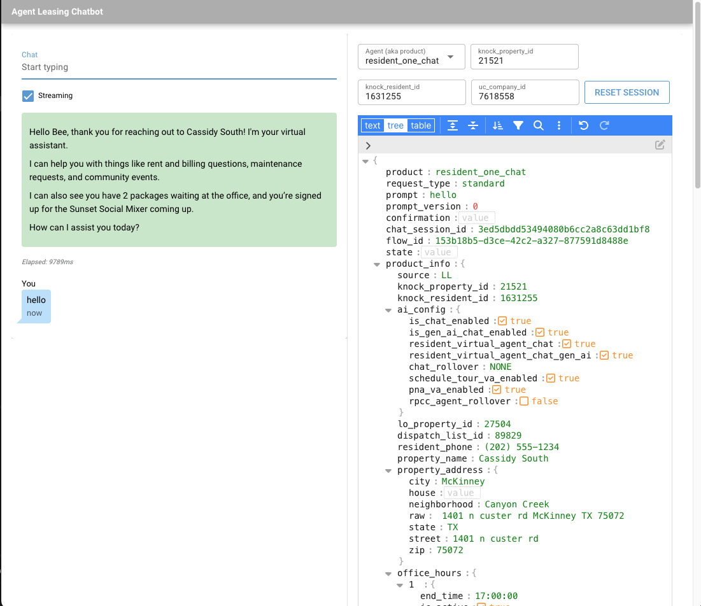

# agent-leasing


Leasing agent implementation based on OpenAI Agents SDK.

The application runs as an API server that also has a chatbot.
It uses [FastAPI](https://fastapi.tiangolo.com/) for the server and
[NiceGUI](https://nicegui.io/) for the chatbot. The agent implementation is built with 
[OpenAI's Agents SDK](https://openai.github.io/openai-agents-python/).

# Installation

You'll need [uv](https://docs.astral.sh/uv/getting-started/installation/).

```shell
git clone git@github.com:knockrentals/agent-leasing.git
cd agent-leasing
uv sync
```

Create a `.env` file based on `.sample.env`.

```shell
cp .sample.env .env
```

You'll need to set `OPENAI_API_KEY`. If you don't have a key, post a message to
the [AI channel](https://teams.microsoft.com/l/channel/19%3Aeb52235ad68c4f19a4820e5eb22edfbd%40thread.skype/AI?groupId=522d272e-5e9d-4716-b751-3643c9b3b63c&tenantId=2c94bed6-d675-4d3d-a53b-7b461fd6acc2)
in Teams.

# Starting the Server

The instructions below are for starting the application with [docker compose](#docker-compose).
For other ways to run the server, see [DEVELOPMENT.md](docs/DEVELOPMENT.md).

## Docker Compose

Start background services:
```shell
docker compose up -d
```
Start the server in the foreground:
```shell
uv run server
```

See [Development](docs/DEVELOPMENT.md) for other approaches.

This will create a stubbed MCP server in addition to an `agent-server`.
The `agent-server` provides an OpenAPI spec and a chatbot.

- Chatbot: http://localhost:8000/chatbot
- OpenAPI spec: http://localhost:8000/docs
- Mock server: http://localhost:1080/mockserver/dashboard
- Voice IO: http://localhost:8000/voice-ui

You can view the [traces](https://platform.openai.com/traces) in OpenAI Dashboard.

Most agents require running MCP servers. A local stubbed MCP server is provided for testing that simulates different MCP servers.

As an alternative to Docker Compose, you can use Aspire. See [DEVELOPMENT.md](docs/DEVELOPMENT.md#aspire) for details.

## Aspire

For details about what Aspire is and the benefits it provides [check here](https://aspire.dev/get-started/what-is-aspire/)

### Prerequisites

1. Install the [prerequisites](https://aspire.dev/get-started/prerequisites/) for Aspire
1. Install the [cli](https://aspire.dev/get-started/install-cli/#install-as-a-native-executable)

### Running and debugging

1. If using VS Code, launch using the [launch configuration](.vscode/launch.json)  Otherwise run the command below:

```shell
aspire run
```

If a browser window does not automatically open, check the console output for a login link to the dashboard.  Once the dashboard is running, you can click on the links under the URL's column for the `agent-leasing` service.

NOTE: The first time you start the application using Aspire, you will see a "Unresolved parameters" banner on the dashboard.  Click the "Enter Values" button and provide your OpenAI API Key as well as LangSmith API Key.  Be sure to select "Save to user secrets" so that you aren't prompted every time you run the application.

## MCP Inspector

The MCP Inspector allows you to view the tools
used by `agent-server` application. You'll want to run this
in a separate terminal:

```bash
npx @modelcontextprotocol/inspector
```

It will be available at http://localhost:6274/
Set the transport to `Streamable HTTP` and use `http://localhost:8042/` as the URL.

You may have to provide a session token, which you can find the command output.

```shell
npx @modelcontextprotocol/inspector

Starting MCP inspector...
⚙️ Proxy server listening on 127.0.0.1:6277
🔑 Session token: f0373665494e881e88d5473aaa0757c5c31788c85528c4efa92144425b003c17
```

Add this to the Configuration section on the bottom of the left pane in the MCP Inspector.

# Using remote environments

Each remote environment has its own env file (`.alpha.env`, `.beta.env`, `.prod.env`).
Use the sync script to pull the latest values from AWS Secrets Manager:

```shell
python scripts/sync_envs.py           # sync all environments
python scripts/sync_envs.py beta      # sync beta only
```

If the env file doesn't exist, it will be created automatically. Each file has an
**OVERRIDES** section (for local developer overrides) and an **AWS** section (synced
from Secrets Manager). The script never touches the OVERRIDES section.

You will need the [AWS CLI](https://aws.amazon.com/cli/) installed and configured with SSO.
If your SSO session has expired, log in first with `aws sso login`.

You probably want to change these:

```
# Use in-memory like this because you won't be able to read AWS Elasticache from your desktop, or point at the local redis instance started by docker compose
REDIS_ENABLED=False
# No need to push data to Kafka for local development
KAFKA_REPORTING_ENABLED=False
# Ensure all modules are enabled, despite what is happening in LDP
LDP_MODULES_ALL_ENABLED=True
# Simulate the payload for voice
TWILIO_TEST_PAYLOAD=/your/test/payloads/beta-voice.json
# Simulate the payload for non-voice
CHATBOT_TEST_PAYLOAD=/your/test/payloads/beta-chat.json
```

See [Endpoints](https://github.com/RealPage/agent-leasing/wiki/Endpoints) for
more information.  When using a remote environment, you will want to simulate the payloads. 
See _Simulating payloads_ below for more information about that.

# Using the chatbot

If running locally, the chatbot is available at http://localhost:8000/chatbot.



The chatbot provided in this project calls the backend API. In the right pane is the
JSON sent to the API in the request body. Editing the JSON may change the behavior of the agent. 
To load a simulated payload see _Simulating payloads_ below .

## Simulating payloads

When running locally, the chatbot will, by default, use a sample payload that matches its test data. 

If running locally using remote services you will need to use an `.env` file for the environment 
you are using as explained above in _Using remote environments_.

Normally, the agent-leasing server is called with a payload containing property and resident information, but this will need to be simulated for the chatbot. The best way to do this is to point the `CHATBOT_TEST_PAYLOAD` environment variable to a local JSON file. Some test payloads are provided in the project [wiki](https://github.com/RealPage/agent-leasing/wiki/Test-Payloads) but they may be stale. To get a fresh payload, you can always check the AWS CloudWatch Insights log.

Two sample payloads sourced from AWS CloudWatch Insights logs are available:
`src/agent_leasing/api/example_data/resident/chat/example_ask_request_ll.alpha.json` (alpha) and
`src/agent_leasing/api/example_data/resident/chat/example_ask_request_ll.beta.json` (beta).

Set `EXAMPLE_PAYLOAD_FLAVOR` to `alpha` or `beta` to choose which payload is used. Use `alpha` when testing against remote services in alpha, and `beta` when testing against beta. If `CHATBOT_TEST_PAYLOAD` is set, it takes precedence over `EXAMPLE_PAYLOAD_FLAVOR`.

# Using the Voice UI

The Voice UI allows developers to talk to the voice agent, but is only an approximation, as it does 
not use Twilio nor does it use websockets. Like the chatbot described above, the Voice UI can use a 
simulated payload by pointing the `TWILIO_TEST_PAYLOAD` to a local JSON file.

See [Using the Voice UI](docs/VOICE_INTERACTION.md) for details.

# Using the CLI

By default, the CLI attaches to the local agent-leasing server. If local, ensure the server is up and running. 
See *Starting the Server* for details.

**With a payload:**
```shell
uv run cli-text src/agent_leasing/api/example_data/resident/chat/example_ask_request_ll.json    
```

**Against alpha:**

```shell
uv run cli-text /path/to/my-alpha-payload.json --url https://alpha-agent-leasing.knocktest.com
```
When running against alpha or other environments, ensure your payload file contains the correct identifiers and
that you aren't trampling on a real resident's session.

The payloads provided as arguments to the CLI override the `CHATBOT_TEST_PAYLOAD` environment variable.

There is also a streaming CLI described in [Streaming](docs/STREAMING.md), which functions the same way.

# Calling the API

Say hello:

```shell
curl -X POST --location "http://127.0.0.1:8000/v1/agent/ask" \
    -H "Content-Type: application/json" \
    -d '{
      "product": "resident_one_chat",
      "prompt": "hello",
      "chat_session_id": "1",
      "request_id": "2",
      "product_info": {
        "knock_prospect_id": "95946",
        "knock_property_id": "21521"
      }
    }'

```
See the other HTTP call examples in [tests/http](tests/http).

# Running the Tests

To run the unit tests, use the following command:
```shell
uv run pytest tests/unit
```

More information can be found in [TESTING.md](docs/TESTING.md).

# Coding Assistants

`AGENTS.md` is provided for coding assistants. If your coding assistant of choice 
does not automatically recognize this file, guide it with `Read and follow all instructions in AGENTS.md`.

# Further Reading

Detailed documentation on the topics below can be found in [docs](docs):
- [Design](docs/DESIGN.md)
- [Development](docs/DEVELOPMENT.md)
- [Testing](docs/TESTING.md)
- [Streaming](docs/STREAMING.md)
- [Voice Interaction](docs/VOICE_INTERACTION.md)
- [Logging](docs/LOGGING.md)
- [Infrastructure](docs/INFRA.md)
- [Endpoints](docs/ENDPOINTS.md)
- [SMS Consent](docs/SMS_CONSENT.md)

## Also see
- Resident AI project [wiki](https://github.com/RealPage/agent-leasing/wiki)
