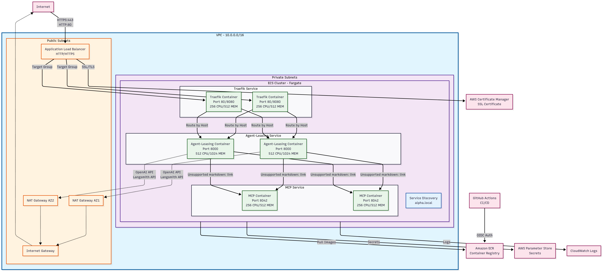

# Deployment

## Environments
- alpha:
  - https://alpha-agent-leasing.knocktest.com/chatbot
  - https://alpha-agent-leasing.knocktest.com/docs
- beta: 
  - TODO
- prod:
  - TODO

The application is deployed using GitHub Actions CI/CD pipelines:

### CI/CD Pipeline
- **CI Pipeline**: Builds and pushes Docker images to AWS ECR (Account: 171267611104)
- **CD Pipeline**: Deploys images from ECR to AWS ECS (Account: 969504524223)

## Infrastructure Overview

See [Infrastructure](docs/INFRA.md)

### Cross-Account Architecture
- **ECR Repository**: Hosted in Knock-Shared-Services account (171267611104)
- **ECS Services**: Running in RenterAI-Product account (969504524223)
- **Authentication**: GitHub OIDC with AWS IAM Roles (no stored credentials)

### Services
- **agent-leasing**: Main application service
- **agent-leasing-mcp**: Model Context Protocol service
- **agent-leasing-voice**: Voice service (same image as main, voice-optimized CPU/scaling)

All three services run as separate ECS services in each environment's cluster.

## Quick Overview

### Automatic Deployments

The CD pipeline automatically deploys after successful CI builds:

- **Alpha (Staging)**: Merges to `alpha` branch trigger automatic deployment
- **Production**: Coming soon - merges to `main` branch will trigger deployment

### Manual Deployment

You can manually trigger deployments via GitHub Actions:

1. Go to Actions → CD Pipeline
2. Click "Run workflow"
3. Select:
   - Environment: `alpha`
   - Image tag: (optional - defaults to `alpha` tag)

### Image Tags

The CI pipeline creates the following tags:
- **Commit-specific**: `main-{shorthash}`, `mcp-{shorthash}`
- **Environment tags**: `alpha`, `mcp-alpha` (for alpha environment)
- **Production tags**: `latest`, `stable`, `mcp-latest`, `mcp-stable` (for production)

### Infrastructure

The application runs on AWS ECS with services in each environment:

| Environment | Cluster | Main Service | Voice Service | MCP Service |
|-------------|---------|--------------|---------------|-------------|
| Alpha | `knock_alpha_rp_ai` | `alpha-agent-leasing` | `alpha-agent-leasing-voice` | `alpha-agent-leasing-mcp` |
| Beta | `knock_beta_rp_ai` | `beta-agent-leasing` | `beta-agent-leasing-voice` | — |
| Prod | `knock_prod_rp_ai` | `prod-agent-leasing` | `prod-agent-leasing-voice` | — |

Infrastructure is managed with Terraform in the `infra/` directory.

### Authentication & Token Management

The application now uses **dynamic token management** for MCP server authentication:

- **No Static Tokens**: The `FACILITIES_MCP_BEARER` environment variable is no longer used
- **Automatic Token Refresh**: Fresh tokens are generated before each MCP server connection
- **Auth Failure Recovery**: Automatic reconnection with fresh tokens when authentication fails
- **Required Environment Variables**:
  - `AUTH_CLIENT_SECRET`: Service account client secret for token generation
  - `AUTH_TOKEN_ENDPOINT`: Identity server endpoint for token requests
  - `AUTH_CLIENT_ID`: Client ID for the facilities service account
  - `AUTH_SCOPES`: Required OAuth scopes for facilities API access

### Monitoring

- **CloudWatch Logs**: `/ecs/{environment}/{service-name}`
- **GitHub Actions**: Deployment status and history
- **ECS Console**: Service health and metrics

### Deployment Architecture

_Generated from [deployment.mmd](deployment.mmd)_

Return to the main [README](../README.md).