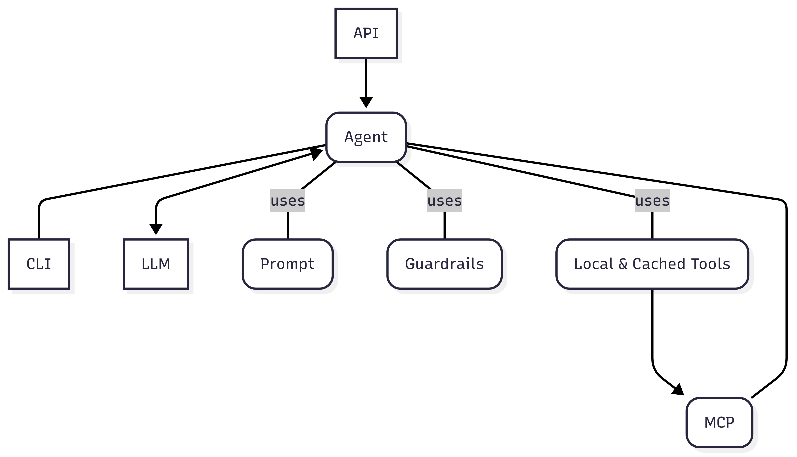
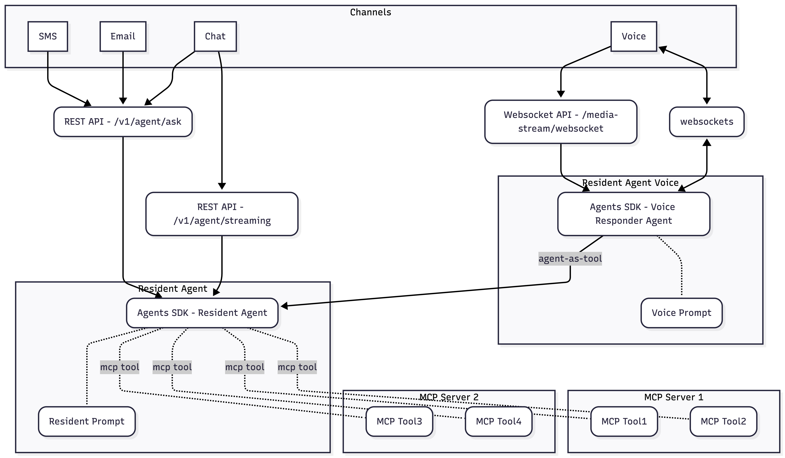

# Design

This application takes an agentic approach to AI: agents have some autonomy to interact 
with language models and tools before returning a response. The focus is on prompts and tools. 
One or more agents may be used together to achieve a goal. 
The [Agents SDK](https://openai.github.io/openai-agents-python/) framework is used
to communicate with [OpenAI](https://platform.openai.com/docs/overview). Agents SDK has the concept to handoffs and 
agents-as-tools to connect agents. It also offers [guardrails](./GUARDRAILS.md), which are triggered 
according to some logic or agent prompt. Triggered guardrails will throw an exception in the code, 
a programming construct that must be handled.

Agent implementations are entirely contained in folders within `agent_leasing/agent`. Each 
folder contains one or more Python modules supporting agent implementations along with prompts 
and additional documentation. Developers are expected to iterate and refine agent implementations to
reach the desired behavior without making agent system prompts unmanageable and also taking care to reduce
latency.

At a high level, a single-agent approach looks like this:


_Generated from [single-agent.mmd](single-agent.mmd)_

The application uses [FastAPI](https://fastapi.tiangolo.com/) for the server and
[NiceGUI](https://nicegui.io/) for the chatbot. [Agents SDK](https://openai.github.io/openai-agents-python/) is used
to communicate with [OpenAI](https://platform.openai.com/docs/overview).

## Software Architecture

The application provides agent interaction through different channels: chat, sms, email and voice.

Chat comes through Loft into the `v1/agent/ask` and `v1/agent/streaming` endpoints. SMS and email come through the 
same `v1/agent/ask` endpoint, and voice comes through the `/media-stream/websocket` websocket endpoint via Twilio by 
way of Knock.

The payloads sent to these endpoints are provided to the agents through prompts. For text-based channels (chat, SMS and email) 
a single agent is connected to MCP servers. For voice, a nimble realtime responder agent uses the same text-based agent as a tool.
This unified approach keeps all business logic in one place.

Also see [the unified agent README](../src/agent_leasing/agent/resident_one_agent/README.md).



### Agent Organization

Agent implementations live in `agent_leasing/agent/<agent_name>/`:

| Agent | Purpose |
|-------|----------------------------------------------------------------|
| `simple` | Basic example agent |
| `applicant` | Applicant-focused agent |
| `resident_one_agent` | Unified resident agent for all channels |

### Product Types and Agent Mapping

The `product` field in API requests determines which agent runs. Product names are defined in 
`api/model.py` as the `Product` enum. The product-to-agent mapping is defined in `AGENT_MAP` 
in `agent/util.py`:

```python
AGENT_MAP = {
    Product.SIMPLE.value: "agent_leasing.agent.simple.agent.SimpleAgent",
    Product.APPLICANT.value: "agent_leasing.agent.applicant.agent.ApplicantAgent",
    Product.RESIDENT_ONE_CHAT.value: "agent_leasing.agent.resident_one_agent.agent.ResidentAgent",
    Product.RESIDENT_ONE_VOICE.value: "agent_leasing.agent.resident_one_agent.realtime.ResidentRealtimeResponderAgent",
    # ... etc
}
```

### Request Flow: Text Channels (Chat, SMS, Email)

When a request arrives at `/v1/agent/ask` or `/v1/agent/stream`:

1. **Build Request** — `build_agent_request(req)` in `services/agent_service.py`:
   - Creates `SessionScope` from the request body
   - Calls `agent_selector(req.product, context)` to get the agent instance
   - Sets up tracing (LangSmith, OpenAI)

2. **Agent Selection** — `agent_selector()` in `agent/util.py`:
   - Looks up `req.product` in `AGENT_MAP` to get the class path
   - Dynamically imports and instantiates the agent class: `agent_class(context)`
   - Example: `product="resident_one_chat"` → `ResidentAgent(context)`

3. **Agent Initialization** — Using async context manager:
   ```python
   async with agent as agent_wth_mcp:
       result = await Runner.run(agent_wth_mcp.agent_instance, input=req.prompt, ...)
   ```
   The `__aenter__` method:
   - Fetches disabled modules from LDP
   - Creates and connects MCP servers
   - Calls `_create_agent()` to build the Agents SDK `Agent` instance
   - Prefetches insights (active service requests, packages, community events)
   - **When `property_marketing_info_tool_enabled = False` (legacy):** also pre-fetches `resident_summary` from LDP and stores it in `context.property_data` for prompt injection

4. **Execution** — `Runner.run()` or `Runner.run_streamed()`:
   - Passes the prompt to the agent
   - Agent interacts with MCP tools as needed
   - Returns result with `final_output` and `last_response_id`

### Request Flow: Voice Channel

Voice requests arrive via Twilio at `/media-stream/websocket`:

1. **WebSocket Connection** — `TwilioWebSocketManager` creates a handler
2. **Payload Extraction** — Handler extracts property/resident info from Twilio metadata
3. **Agent Selection** — Same `agent_selector()` flow, but with voice product (e.g., `resident_one_voice`)
4. **Realtime Agent** — For voice, `ResidentRealtimeResponderAgent` wraps `ResidentAgent` as a tool

### Unified Voice Architecture

The voice channel uses a **responder/thinker** pattern, but with a single thinker:

- **Responder**: `ResidentRealtimeResponderAgent` — a nimble realtime agent that handles voice communication
- **Thinker**: `ResidentAgent` — the same unified agent used for text channels, exposed as a tool

This approach keeps all business logic in `ResidentAgent` while allowing the realtime responder to handle 
voice-specific concerns like turn-taking and filler phrases. See [ADR 008](adr/008-unified-voice.md) for the decision rationale.

## AgentWithMCP Base Class

All agent implementations extend the `AgentWithMCP` abstract base class (defined in `agent/util.py`). 
This class provides:

- **MCP server management** via `mcp_servers` dict
- **Async context manager protocol** (`__aenter__`/`__aexit__`) for resource lifecycle
- **Prompt caching** via `_get_prompt()` with version support
- **Agent architecture tracking** (`SINGLE_AGENT` or `RESPONDER_THINKER`)

```python
class AgentWithMCP(abc.ABC):
    def __init__(self, context: SessionScope) -> None:
        self.context = context
        self.mcp_servers = {}
        self.agent_architecture = AgentArchitecture.SINGLE_AGENT
    
    @abc.abstractmethod
    def agent(self) -> Agent | RealtimeAgent:
        pass
```

### Context Manager Pattern

Agents use async context managers to manage MCP server connections and cleanup:

```python
async with agent:
    # __aenter__: Connects MCP servers, fetches modules, prefetches data
    result = await agent.run(...)
    # __aexit__: Cleans up MCP connections in LIFO order via AsyncExitStack
```

The `__aenter__` method:
1. Creates an `AsyncExitStack` for LIFO cleanup
2. Connects all MCP servers (failed servers are removed gracefully)
3. Calls `_create_agent()` to build the agent instance
4. Resets the context state

Always use context managers to ensure proper resource cleanup.

## Memory, Context, and Renter Settings

To get property information, the agent requires a property ID and a prospect ID.
These are contained in the body of the request to the `/v1/agents/ask` endpoint of the API.

These settings are stored in a local context object (`SessionScope`) that is
passed around the Agents SDK. The context is also used to dynamically update agent prompts.
[Jinja](https://jinja.palletsprojects.com/en/stable/) templates are used to inject context 
into the prompts. 

The application supports two modes for managing message history, controlled by the
`USE_CONVERSATIONS_API` environment variable (default: `false`):

- **`previous_response_id` (default):** Chains responses linearly via OpenAI's
  [Responses API](https://platform.openai.com/docs/api-reference/responses).
  The ID is returned in the `X-OpenAI-Previous-Response-Id` response header.
- **Conversations API (`USE_CONVERSATIONS_API=true`):** Creates a server-side
  [Conversation](https://developers.openai.com/api/docs/guides/conversation-state)
  that accumulates all responses automatically.  The conversation ID is returned
  in the `X-OpenAI-Conversation-Id` response header and can be shared with
  external services (e.g. Facilities API) so they can access the conversation
  history directly.

For voice, the Realtime API session does not support `conversation_id`; only the
thinker tool (which uses the standard Responses API via `Runner.run`) participates
in the conversation.

To see an example of fetching the message history from OpenAI see
[message_history.py](../src/examples/message_history.py).

### SessionScope

`SessionScope` (defined in `models/context.py`) maintains state throughout agent execution:

| Field | Purpose |
|-------|-----------------------------------------------|
| `ask_request` | The JSON request body sent to `/v1/agent/ask` |
| `previous_response_id` | Conversation history via OpenAI's Responses API |
| `openai_conversation_id` | Conversation ID when using the Conversations API |
| `disabled_modules` | Feature toggles from LDP |
| `disabled_tools` | MCP tools disabled based on modules |
| `mcp_tool_calls` | Tracking of MCP tool calls for data curation |
| `langsmith_run_tree` | Tracing metadata for LangSmith |
| `openai_trace_id` | Tracing metadata for OpenAI |
| `handoff` | Flag indicating handoff to human requested |
| `sms_consent_status` | SMS consent tracking |
| `property_data` | Property marketing summary — populated from LDP `resident_summary` and injected into the prompt when `property_marketing_info_tool_enabled = False` (legacy); empty/unused when the `get_property_marketing_info` tool is active (`= True`) |

The context also provides convenience properties like `property_id`, `prospect_id`, and `persona`
derived from the request data.

### Handoff Moratorium

When a resident is handed off to staff on SMS or EMAIL channels, the agent writes a Redis key
that pauses AI responses for a configurable period (`settings.handoff_inactivity_ttl`). This
prevents the agent from responding to follow-up messages while the resident is talking to a human.

The Redis key format is `{app_name}:{product}_{property_id}_{handoff_subject_id}`. The
`handoff_subject_id` is `knock_resident_id` when available; otherwise it falls back to
`ab_resident_id` for requests that do not have a Knock resident ID yet (for example some
AIRR-sourced requests). The subject ID is namespaced by source (`kn:<id>` or `ab:<id>`) so
Knock and ActiveBuilding IDs cannot collide if they happen to share the same raw value. Both
the write path and the read path use the same fallback so the handoff lookup stays scoped to
the correct resident.

**Write path** — `transfer_to_staff_text.py`: After the `transfer_to_staff` tool fires, the
handoff state is written to Redis if the channel is SMS or EMAIL and at least one of
`knock_resident_id` or `ab_resident_id` is present (along with `property_id`).

**Read path** — `server.py:_handle_active_handoff()`: Before running the agent, checks Redis
for an active handoff via `handoff.py:is_handoff_active()`. If found, returns a static handoff
response without invoking the agent. During rollout, the read path also accepts the legacy
non-prefixed key format so active moratoriums survive deploys.

A separate code path in `_handle_url_transfer()` also writes handoff state for URL-based
transfers, using the same resident-ID fallback keying.

## Module System

Properties have feature toggles via modules (fetched from LDP). These control which tools 
are available to the agent:

| Module | Controls |
|--------|----------|
| `PAYMENT_CENTER` | Policy & Ledger tools (rent info, lease terms) |
| `PARKING_PASS` | Guest parking pass tools |
| `PACKAGES` | Package tracking tools |
| `EVENTS` | Community events tools |
| `MR` | Maintenance/Facilities tools |

Disabled modules prevent specific MCP tools from being available. Mappings are defined in
`clients/ldp.py`:

- `MODULE_TO_MCP_TOOLS`: Maps modules to MCP tools
- `MODULE_TO_THINKER_TOOL`: Maps modules to thinker tools (legacy Responder/Thinker pattern)

```python
# Example: Property with MR disabled won't have facilities tools
if "MR" not in context.disabled_modules:
    mcp_servers["facilities_mcp_server"] = _create_facilities_mcp_server(context)
```

## CachingMCPServer

`CachingMCPServer` (defined in `clients/mcp.py`) extends `MCPServerStreamableHttp` from the 
Agents SDK with additional capabilities:

### Tool Caching

Agents can cache their MCP tool calls. The caching is not keyed on user; the mechanism simply uses 
the tool name and the function parameters as a key.

```python
from agent_leasing.clients.mcp import CachingMCPServer
property_mcp_server = CachingMCPServer(
    name="Caching MCP Server",
    params={"url": "http://SERVER_URL", "headers": {}},
    cached_tools=["get_property_overview"],
    ttl="2h",  # Cache expiry time
)
```

### Dynamic Authentication

MCP servers can be configured with an `auth_function` that provides automatic token management:
- Tokens are refreshed before each tool call
- 401 errors trigger automatic reconnection with fresh tokens
- Failed auth recovery is logged but doesn't crash the application

```python
CachingMCPServer(
    name="Knock MCP Server",
    params={"url": settings.knock_mcp_server, "headers": {}},
    auth_function=get_knock_mcp_auth_token if settings.knock_mcp_auth_enabled else None,
)
```

### Graceful Degradation

Errors are caught and returned as tool results with `isError=True`, allowing the LLM to handle 
failures gracefully instead of crashing:

```python
# Errors are converted to informative messages for the LLM
return CallToolResult(
    content=[TextContent(text=self._format_tool_error(tool_name, e), type="text")],
    isError=True,
)
```

The error messages guide the LLM to inform users about issues and offer alternatives like 
connecting with staff.

### Tool Pre and Post Processors

`CachingMCPServer` supports transforming tool inputs and outputs through processor functions:

```python
CachingMCPServer(
    name="Loft MCP Server",
    params={"url": settings.loft_mcp_server, "headers": {}},
    tool_pre_processors=create_mcp_pre_processors(guardrail_tools=enabled_tools),
    tool_post_processors=create_mcp_post_processors(
        guardrail_tools=enabled_tools,
        extras={"fetch_community_events": [modify_events_output]},
    ),
)
```

**Pre-processors** transform tool arguments before the call:
- Useful for sanitizing inputs
- Applied in sequence; failures skip that processor

**Post-processors** transform tool results after the call:
- Used for PII redaction, output formatting, data filtering
- Applied in sequence; failures skip that processor
- Common use cases: redacting sensitive data, modifying response structure

Processor functions are defined in `agent/tools/mcp_pre_processors.py` and `agent/tools/mcp_post_processors.py`.

## Inject Tool Outputs into Prompts

Tool outputs can be injected into an Agent's system prompt, which may prevent an additional call to the responses API, improving latency. To do this, the Agent's context must have a variable to hold the tool's output. It can then be injected into the Agent's instructions dynamically.

For an example, see how `context.packages` is injected for the resident agent — active package data is pre-fetched during `__aenter__` and rendered in the prompt template as `{{ context.packages }}`.

The `property_data` field follows this same pattern in **legacy mode** (`property_marketing_info_tool_enabled = False`). `resident_summary` is fetched from LDP during `__aenter__`, stored in `context.property_data`, and then rendered in the prompt template:

```python
# agent_helper.py — legacy path (flag = False)
if not settings.property_marketing_info_tool_enabled and resident_summary and not context.property_data:
    context.property_data = resident_summary
```

```jinja
{# INSTRUCTIONS.md — legacy path #}

## PROPERTY INFORMATION
{{ context.property_data }}

```

## On-Demand Data via Local Function Tools

An alternative to prompt injection is to expose data through a local `@function_tool` that the model calls only when it actually needs the data. This avoids inflating every prompt with information that is rarely used, and relies on the model's judgment about when to fetch it.

The `get_property_marketing_info` tool is the canonical example for **tool mode** (`property_marketing_info_tool_enabled = True`, the default). Property marketing data (`resident_summary` from LDP) is **not** pre-fetched or injected into the system prompt. Instead, the tool fetches it on demand from the warm LDP cache when the model determines it needs property marketing or descriptive information (amenities, neighborhood, positioning copy). Because the cache key `early:v2:ldp_property_data:{property_id}` is shared with other LDP consumers in the same request, no additional network call occurs.

The tool is registered in `agent/tools/get_property_marketing_info/get_property_marketing_info.py` and follows the same pattern as `verify_resident_identity` and `create_link`:

```python
@function_tool(description_override=DESCRIPTION)
async def get_property_marketing_info(ctx: RunContextWrapper[Any]) -> str:
    return await _get_property_marketing_info_impl(ctx.context.property_id)

@traceable(run_type="tool", name="get_property_marketing_info")
async def _get_property_marketing_info_impl(property_id: str) -> str:
    ldp_data = await fetch_ldp_property_data(property_id)
    if not ldp_data or not ldp_data.resident_summary:
        return "No property marketing information is available."
    return ldp_data.resident_summary
```

The prompt instructs the model to call this tool the first time it needs marketing information and reuse the result from conversation history on subsequent turns:

```jinja
{# INSTRUCTIONS.md — tool path #}

Property marketing information (amenities, positioning copy, neighbourhood details) is
available on demand via the `get_property_marketing_info` tool. Call it the first time
you trigger this workflow; reuse the result from conversation history on subsequent turns.

```

> **Feature flag:** `settings.property_marketing_info_tool_enabled` (env var `PROPERTY_MARKETING_INFO_TOOL_ENABLED`) controls which path is active. `True` (default) → tool registered, no prompt injection. `False` (legacy) → `property_data` pre-fetched, stored in `SessionScope`, injected via `{{ context.property_data }}`. The flag will be removed once the tool-based path is validated in production.

## Dynamic Prompt Initialization

Agent prompts are Jinja2 markdown templates located in agent folders (e.g., `INSTRUCTIONS.md`). 
Prompts are dynamically rendered at runtime using `SessionScope` data.

### Prompt Loading and Versioning

The `AgentWithMCP._get_prompt()` method handles prompt loading with caching and version support:

- **Version 0**: Base file (e.g., `INSTRUCTIONS.md`)
- **Version N**: Versioned file (e.g., `INSTRUCTIONS_V2.md`)
- **Fallback**: If requested version doesn't exist, falls back to version 0
- **Caching**: All versions are loaded and cached on first access

```python
instructions_file = os.path.join(os.path.dirname(__file__), "INSTRUCTIONS.md")
self.prompt = self._get_prompt(instructions_file, version=2)  # Loads INSTRUCTIONS_V2.md
```

### Dynamic Instructions

Agents can override `_get_agent_instructions()` to inject runtime data into prompts:

```python
async def _get_agent_instructions(
    self,
    run_context: RunContextWrapper[SessionScope],
    agent: Agent[SessionScope],
) -> str:
    environment = jinja2.Environment()
    template = environment.from_string(self.prompt)
    
    return template.render(
        current_time=run_context.context.current_time.isoformat(),
        context=run_context.context,
        channel=get_channel_from_context(run_context.context),
        disabled_modules=self.context.disabled_modules,
    )
```

In the template, these values are accessed as `{{context.packages}}`, `{{channel}}`, etc. When `property_marketing_info_tool_enabled = False`, `{{context.property_data}}` is also available and injected into the prompt via the `` block in `INSTRUCTIONS.md`.

## Creating a New Agent

1. Create folder: `src/agent_leasing/agent/<agent_name>/`
2. Add product to `Product` enum in `src/agent_leasing/api/model.py`
3. Copy files from `src/agent_leasing/agent/simple/` and rename classes
4. Add entry to `AGENT_MAP` in `src/agent_leasing/agent/util.py`
5. Create prompts (`INSTRUCTIONS.md` for text, `VOICE_RESPONDER.md` for voice) — see prompt requirements in `AGENTS.md`
6. Implement `_create_agent()` method and MCP server setup
7. Add unit tests for new functions
8. Add integration tests in `tests/integration/agent/<agent_name>/`
9. Add LLM-as-judge tests to validate semantic correctness of responses
10. Update the stubbed MCP server (`tests/stubbed_mcp.py`) with any new tool responses needed

See [DEVELOPMENT.md](DEVELOPMENT.md) for a detailed walkthrough with examples.

## Additional Topics

For specialized topics and deep-dives, see:

| Topic | Document |
|-------|----------|
| Filler phrases in voice interactions | [FILLER_PHRASES.md](FILLER_PHRASES.md) - How the voice agent uses automated messages during extended silence to maintain user engagement |
| Guardrails system | [GUARDRAILS.md](GUARDRAILS.md) - Input/output content moderation and safety controls |
| Voice interaction patterns | [VOICE_INTERACTION.md](VOICE_INTERACTION.md) - Realtime voice agent architecture and Twilio integration |
| Testing strategies | [TESTING.md](TESTING.md) - Unit, integration, and LLM-as-judge testing approaches |

Return to the main [README](../README.md).
