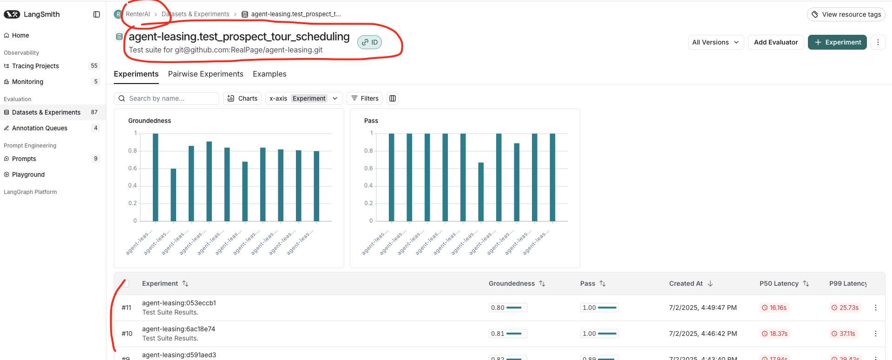
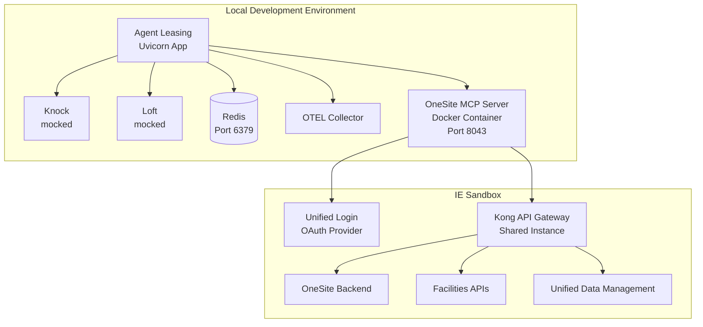

# Development

The application requires a running MCP server. You can either use an existing MCP server
or run a local stubbed version for testing purposes.

When you run docker compose, an MCP server is created for you. Before you do this set up your env
files as explained in the [README](../README.md). To sync env files with AWS Secrets Manager:

```shell
python scripts/sync_envs.py           # sync all environments
python scripts/sync_envs.py alpha     # sync a specific environment
```

```shell
docker compose up -d
```

To run the local stubbed MCP server separately from docker compose:

```shell
uv run tests/stubbed_mcp.py
```

The server should be up and running at `http://0.0.0.0:8042/`.

Or run MCP with Docker:

```shell
docker build -f MCP.dockerfile . -t stubbed-mcp
docker run -d -p 8042:8042 stubbed-mcp
```

You can now start the application. You may want to do this in a separate
terminal if the MCP server started above is local and running in the foreground.

```shell
uv run server
```

## Load Testing

See the [Load Testing](TESTING.md#load-testing) section in TESTING.md for details on running Locust-based load tests against local or remote environments.

## Support for Multiple Agents

This application supports multiple agent implementations.
Agent name is synonymous with the `product` element passed in the JSON passed to this application's API endpoints.
These are defined in a `Product` enum in [model.py](../src/agent_leasing/api/model.py).
The CLI and chatbot can be supplied with different agent names.

## Creating a new agent

To create a new agent that answers questions about canines, follow the steps below.
1. Checkout a new branch
2. Add a folder in `src/agent_leasing/agent` called `canines`.
3. Add a product to `Product` model `src/agent_leasing/api/model.py`. The product name determines what agent will run.
4. Copy files from `src/agent_leasing/agent/simple` and rename `SimpleAgent` to `CanineAgent`.
5. Add an entry for `CanineAgent` to `AGENT_MAP` in `src/agent_leasing/util/agent_util.py`.
6. Modify the agent and prompt as needed.
7. Run the server (`uv run server`) to confirm it is working. If the agent requires an MCP server, ensure it is running.

## Git Workflow & Branch Protection

This project uses a structured Git workflow with protected branches.

- **Protected Branches**: Both `main` (production) and `alpha` (staging) are protected
- **No Direct Commits**: All changes must go through pull requests
- **Branch Naming**: Use `KNCK-<number>` or `KNCK-<number>-<description>` format (see [workflow docs](TEAM_WORKFLOW.md))
- **Conventional Commits**: Follow the format `type(scope): description`
- **Release Process**: Only `alpha` can be merged into `main` for releases

## Raising a PR

```bash
# Always start from an updated alpha branch
git checkout alpha
git pull origin alpha

# Create your branch with KNCK ticket number
git checkout -b KNCK-XXXX
# Or with description
git checkout -b KNCK-XXXX-your-feature-name

# Make changes and commit using conventional commits
git add .
git commit -m "feat: add new feature"

# Push and create PR to alpha
git push origin KNCK-XXXX
```

## Formatting
Check source formatting
```shell
uv run ruff check
```
Format `tools.py`:
```shell
uv run ruff format src/agent_leasing/tools.py
```
Fix `tools.py`:
```shell
uv run ruff check --fix src/agent_leasing/tools.py
```

To enable pre-commit hooks that perform the ruff linting and formatting:
```shell
uv run pre-commit install
```

# Testing

Run the unit tests:

```shell
uv run pytest tests/unit
```

For e2e and integration tests, the local stubbed MCP server must be running. If it is not already running,
start it following the instructions in above or start it with docker compose as described in the main README.

Run all the tests with an HTML coverage report:

```shell
uv run pytest --cov --cov-report html
```

Open `coverage/index.html` in a browser to see the results.

Run tests in parallel because you are impatient:
```shell
uv run pytest -n 5
```
This uses five workers. See [pytest-xdist](https://pytest-with-eric.com/plugins/pytest-xdist/) for more information. Note that running tests
in parallel may result in failures with unclear causes.

Note that running in pytest in parallel can result in all kinds of subtle and hard-to-debug problems,
so proceed with caution.

To repeat a test:
```shell
uv run pytest --count 2 -k test_schedule_tour_invalid_preferences
```

See [pytest-repeat](https://github.com/pytest-dev/pytest-repeat) for more information.

Note that a fixed date and time of June 25, 2025, at 11am is injected into the context
for consistency while testing.

## Testing with LangSmith

Some tests use LangSmith. These use the `@pytest.mark.langsmith()` annotation.
To run all the tests and to have the option of using
on-line evaluations in LangSmith, make sure the `LANGSMITH_API_KEY` and `LANGSMITH_ENDPOINT`
is set in your `.env` file.

Run only the LangSmith tests:

```shell
uv run pytest -m langsmith
```
You can follow the test traces in LangSmith:



The tests will appear in Datasets & Experiments as `[PROJECT_NAME].[TEST_FILE]`.

For more about testing with LangSmith at RealPage
see [Langsmith Evaluations](https://www.notion.so/thelivingsuite/Langsmith-Evaluations-19a32639d9c48021a28beec4d2e98f3c)
in Notion.

Some helper functions are provided to log to LangSmith. See `assert_grounded_diff_multi_turn_pairs`
in `conftest.py` for an example, and look at the tests in `test_prospect_tour_scheduling.py`, which
make use of this function.

# Examples

See the [examples](../src/examples) folder for general Agents SDK examples.

See [hello.py](../src/agent_leasing/agent/simple/hello.py) for an example of how to call
an agent implementation with MCP.

# Debugging

In your IDE of choice directly run `server.py` with the debugger.

To automatically reload the application after changes to files use `--reload` and start
with FastAPI:

```shell
uv run fastapi run server.py --reload
```

## Test With Different Agent Prompts

The agent defined in the `simple` folder allows prompts to be passed in.
The default behavior is to use the prompt defined in the Markdown file in the same directory.
This gives us a mechanism to test different prompts for the same agent, but it is limited. It should
be leveraged to allow prompt changes to be directed by data passed into the application's API.

## Using with your favorite IDE

- **PyCharm** will automatically recognize a local virtual environment in the `.venv` folder. You will
  already have this if you followed a project's instructions and ran `uv sync`. There is nothing else to do.
- **Visual Studio Code**: In the Command Palette (`⇧⌘P`) type _Python: Select Interpreter_ and choose
  the local `.venv` folder. Use `pytest` for the test framework. You are good to go.

# Aspire

Aspire provides an alternative to Docker compose for local development.
For details about what Aspire is and the benefits it provides [check here](https://aspire.dev/get-started/what-is-aspire/).
The biggest benefit for developers is probably the ability to view telemetry locally.

> **Note on naming:** Despite the repository name `agent-leasing`, this codebase powers the **Resident Agent** (also known as "Living"), not leasing functionality.

## Prerequisites

### Development Tools

- [.NET SDK 10.0+](https://dotnet.microsoft.com/download/dotnet/10.0) (required for Aspire; macOS: `brew install dotnet@10`)
- [Aspire CLI](https://aspire.dev/get-started/install-cli/#install-as-a-native-executable)
- [uv](https://docs.astral.sh/uv/getting-started/installation/) (Python package manager)
  - macOS: `brew install uv` or `curl -LsSf https://astral.sh/uv/install.sh | sh`
  - Windows: `powershell -ExecutionPolicy ByPass -c "irm https://astral.sh/uv/install.ps1 | iex"`
- Docker Desktop (must be running before starting Aspire)
- Access to RealPage Docker registry: `artifacts.realpage.com`

### Platform Notes

This guide has been tested on **macOS**. Windows users may encounter additional setup requirements:
- Aspire installation may require additional steps on Windows
- You may need Windows administrator credentials to install and run certain tools
- Ensure your machine has sufficient resources to run Aspire + Docker containers simultaneously
- Minimum system requirements are not yet documented—if you encounter resource issues, please report them

## Running with Docker Compose

Docker Compose provides a simpler alternative if you don't need Aspire's telemetry features:

```shell
docker compose up -d
```

## Running with Aspire

If your `.env` references a port for a service started with Aspire, it may not match the port
randomly generated by Aspire. For example, if `OTEL_EXPORTER_OTLP_TRACES_ENDPOINT` is set to
`http://localhost:4318/v1/traces` it will not match because `4318` is the default port. In these
cases, commenting out the environment variable is probably the best solution.

If using VS Code, launch using the [launch configuration](.vscode/launch.json). Otherwise run the command below:

```shell
cd aspire-app
aspire run
```

If a browser window does not automatically open, check the console output for a login link to the dashboard.
Once the dashboard is running, you can click on the links under the URL's column for the `agent-leasing` service.

NOTE: The first time you start the application using Aspire, you will see a "Unresolved parameters" banner on the dashboard.
Click the "Enter Values" button and provide your OpenAI API Key as well as LangSmith API Key.
Be sure to select "Save to user secrets" so that you aren't prompted every time you run the application.

NOTE: If using MCP Inspector from Aspire, select Proxy instead of Direct connection type.

---

# IE Sandbox Integration

This section documents how to set up a local development environment that integrates with RealPage Integrated Environment (IE) sandboxes for backend dependencies.

## Overview

**Goal:** Run agent-leasing locally while connecting to real backend services (OneSite, Facilities, Unified Login) hosted in an IE sandbox, enabling integration testing without full environment deployment.

**Current integration status:**
- **OneSite & Facilities:** Integrated with IE sandboxes
- **Knock & Loft:** Currently mocked

**Repository dependencies:** This setup requires both the `agent-leasing` repo and the `facilities-service-request-mcp-server` repo to be cloned as sibling directories. The Aspire configuration references the facilities MCP server at a relative path.

## Access Requirements

1. **AD Group Membership:** `AGAa-IntEnvSandboxUI-Users`
   - Request via SalesForce if needed (example: SR-1995751)
   - [Verify your membership in Azure Portal](https://portal.azure.com/#view/Microsoft_AAD_IAM/GroupMembersList.ReactView/groupId/4ad3f6b6-f141-48c9-8891-ce6899d0acb1)

2. **Sandbox UI Access:** https://sandboxes.dev.sb.realpage.com/
   - Requires AD group membership above

3. **Rancher Access (Optional):** For viewing sandbox containers and logs
   - Cluster: `rp1-nonprod-ie`
   - Requires separate AD group: `AGAa-Rancher-IE-Users`

## Sandbox Configuration

**You should create your own sandbox** for testing. The sandbox name is passed as an environment variable when running Aspire.

### Creating a New Sandbox

1. Go to [Sandbox UI](https://sandboxes.dev.sb.realpage.com/)
2. Click "Create Sandbox"
3. Select the following products:
   - **OneSite**
   - **NUE Facilities**
   - **CDS**
   - **UPFMS**
4. Leave **Pipeline Branch** as the default (other optional fields can be skipped)
5. Wait ~30 minutes for the sandbox to spin up

> **Note:** The UI does not display version or golden image information for the selected products. This is expected behavior, a known limitation of the IE Sandbox UI. A golden image list can be found at https://tfs.realpage.com/tfs/Realpage/Integrated%20Environments/_git/iesandbox-automation?path=/shared/azure/gi_automation/gi-list.json but we lack a way to correlate those versions to commit shas or release tags for the corresponding products.

### Sandbox Lifecycle

- **Default expiration:** 3 days
- **Extended retention:** Contact Asit Kaushik or Habib Madani
- **Spin-up time:** ~35 minutes depending on products selected
- **Data options:**
  - Default: RP NorthStar (static data, ~1 year old) - recommended for initial testing
  - Alternative: Data migration tool to copy from prod companies (if using this, you'll need to adjust the `uc_*_id` values in the chatbot to match your migrated data - skip this initially)

## Setup Instructions

### 1. Clone the Repositories and Install Dependencies

```bash
# Clone both repositories as siblings (clone agent-leasing first)
git clone https://github.com/RealPage/agent-leasing.git
git clone https://dev.azure.com/Realpage-Azure/SpendAndAccounting/_git/facilities-service-request-mcp-server

# Install dependencies for agent-leasing
cd agent-leasing
uv sync
cd ..

# Install dependencies for facilities MCP server
cd facilities-service-request-mcp-server
uv sync
cd ..
```

Your folder structure should now look like:
```
parent-folder/
├── agent-leasing/
└── facilities-service-request-mcp-server/
```

> **Note:** The `facilities-service-request-mcp-server` repo must be cloned as a sibling directory to `agent-leasing`. The Aspire configuration references it at `../../facilities-service-request-mcp-server`.

> **Important:** Running `uv sync` in each repository is required to install Python dependencies. Skipping this step can cause cryptic errors when running the MCP servers.

### 2. Install Aspire CLI

Follow the [Aspire installation guide](https://aspire.dev/get-started/install-cli/#install-as-a-native-executable).

### 3. Credentials (Pre-configured)

The `apphost.cs` file includes working credentials for both MCP servers:

| Service | Auth Method | Configuration |
|---------|-------------|---------------|
| **OneSite MCP** | API Key | `OS_API_KEY` - shared key supported by all OneSite sandboxes |
| **Facilities MCP** | OAuth | Client `ai-agent-facilities` with secret `SECRET` |

No changes needed, the default values in `apphost.cs` work with all IE sandboxes.

### 4. Run with Aspire

Ensure Docker Desktop is running before starting Aspire.

> **Important:** Run Aspire directly in a terminal window—do not delegate this to an AI assistant or IDE task runner. You need manual control for proper restart handling (see below).

```bash
cd agent-leasing/aspire-app
SANDBOX_NAME=your-sandbox-name aspire run
```

Replace `your-sandbox-name` with your sandbox name (e.g., `cutzo6xah`).

> **Note (macOS):** If you see an error about .NET SDK not found, install it via Homebrew:
> ```bash
> brew install dotnet@10
> ```
> Then add to your PATH:
> ```bash
> echo 'export PATH="/opt/homebrew/opt/dotnet@10/bin:$PATH"' >> ~/.zshrc
> source ~/.zshrc
> ```

On first run, you'll see an "Unresolved parameters" banner. Click "Enter Values" and provide:
- OpenAI API Key
- LangSmith API Key

Select "Save to user secrets" to persist these values.

#### Restarting Aspire

If you need to restart Aspire (e.g., after code changes or errors):

1. Press **Ctrl+C** in the terminal to stop Aspire
2. **Open Docker Desktop** and verify all containers from the previous run have been removed
   - If containers are still running, stop and remove them manually
   - Stale containers can cause port conflicts on restart
3. Run `aspire run` again
4. **Close any open chatbot browser tabs** — the port is randomly assigned on each run, so old URLs will not work
5. Open the Aspire dashboard from the new terminal output and navigate fresh (reload from the base path to start in a clean state)

### 5. Verify Sandbox Endpoints

Before accessing the application, verify your sandbox is reachable using the verification script:

```bash
uv run scripts/verify_sandbox.py YOUR_SANDBOX_NAME --verbose
```

### 6. Warm Up OAuth Tokens

The first request to the chatbot will be slow (~60 seconds) while OAuth tokens are initialized. To avoid this during testing, run the warmup after Aspire is running:

```bash
uv run scripts/verify_sandbox.py YOUR_SANDBOX_NAME --warmup
```

The script auto-detects the agent-leasing URL from the running Aspire instance. This sends a test question to the agent and waits for OAuth initialization to complete. Subsequent requests will be fast (~1 second).

### 7. Access the Application

Once running, find the chatbot URL in the Aspire dashboard:
1. Open the dashboard URL shown in the terminal output
2. Look for the `agent-leasing` resource row
3. Click the **Chatbot** link in that row

> **Note:** The port is dynamically assigned by Aspire and will vary between runs. Only the chatbot UI is configured for sandbox integration at present. Voice UI and other endpoints are not yet integrated with sandbox backends.

## Verification

### Test Questions by Backend

See [Sandbox Test Cases](SANDBOX_TEST_CASES.md) for the full list of test questions extracted from TFS.

To regenerate the test case file from TFS:

```bash
uv run scripts/fetch_tfs_test_cases.py --update-docs          # fetch from API
uv run scripts/fetch_tfs_test_cases.py --update-docs --cached  # use local cache
```

Requires `TFS_PAT_TOKEN` — see [`.sample.env`](../.sample.env) for setup.

### Important Notes

- **Chatbot interactions may succeed only sporadically** due to prompt engineering variations or occasional timeouts (if the sandbox hasn't been used recently, the OneSite cache/app pool goes to sleep and the first call typically times out)
- The `uc_*_id` parameters (e.g., `uc_company_id`) are actually **OneSite IDs** despite the naming
- These IDs must match valid records in the OneSite sandbox
- **Knock & Loft** are mocked in the current configuration
- First request to OneSite tools takes ~60 seconds (OAuth token init), subsequent requests are ~1 second

## Configuration Reference

### URL Patterns

| Endpoint Type | Pattern |
|---------------|---------|
| OAuth Token | `https://{sandbox}-upfm-ui.dev.sb.realpage.com/login/identity/connect/token` |
| OAuth Discovery | `https://{sandbox}-upfm-ui.dev.sb.realpage.com/login/identity/.well-known/openid-configuration` |
| Kong Gateway | `https://internalapi-sandbox.realpage.com/{sandbox}/` |
| OneSite API | `https://internalapi-sandbox.realpage.com/{sandbox}/os/` |

### Environment Variables (apphost.cs)

Key environment variables configured in the Aspire app host:

```csharp
// OneSite MCP Server
.WithEnvironment("OAuth_issuer", $"https://{sandboxName}-upfm-ui.dev.sb.realpage.com/login/identity")
.WithEnvironment("OS_KONG_URL", $"https://internalapi-sandbox.realpage.com/{sandboxName}/os/")

// Agent Leasing
.WithEnvironment("ONESITE_MCP_SERVER", onesiteMcpServer.GetEndpoint("http"))
.WithEnvironment("ONESITE_MCP_AUTH_TOKEN_ENDPOINT", $"https://{sandboxName}-upfm-ui.dev.sb.realpage.com/login/identity/connect/token")
.WithEnvironment("ONESITE_MCP_AUTH_CLIENT_ID", "resident-ai-agent")
```

### Available OAuth Scopes in Sandbox

The following scopes are supported (verified via OpenID discovery):
- `facilitiescommonapi`
- `facilitiesinspectionsapi`
- `facilitiesservicerequestsapi`
- `facilitiesinventoryapi`
- `facilitiesassetsapi`
- `facilitiesapprovalsapi`
- `unifiedamenitiesonesite`
- `unifiedsettingsapi`
- `bluebookapi`

## Troubleshooting

### Stale Containers / Port Conflicts

**Symptom:** Aspire fails to start or reports port conflicts after a restart

**Cause:** Previous Aspire run left containers running (common if Aspire was terminated abruptly)

**Solution:**
1. Open Docker Desktop
2. Go to the Containers view
3. Stop and remove any containers from the previous agent-leasing/Aspire run
4. Try `aspire run` again

### Cryptic Facilities MCP Errors

**Symptom:** Facilities MCP server shows unclear errors when trying to create or query service requests

**Cause:** Python dependencies not installed or out of sync

**Solution:**
1. Stop Aspire (Ctrl+C)
2. Navigate to each repository and reinstall dependencies:
   ```bash
   cd facilities-service-request-mcp-server
   uv sync
   cd ../agent-leasing
   uv sync
   ```
3. Restart Aspire

### Finding Facilities Logs

**Symptom:** Need to debug Facilities integration but can't find logs

**Note:** The Sandbox UI provides deep links to logs for OneSite, UPFM, and other services, but does **not** currently provide a deep link for Facilities logs.

**Solution:**
1. For **local** Facilities MCP logs: Check the Aspire dashboard—click on the `facilities-mcp` resource to view its console output
   - The Aspire dashboard shows structured logs with timestamps and log levels
   - Use the **Console** tab to see real-time output from the MCP server
   - Use the **Traces** tab to follow requests across services (helpful for debugging OAuth flows)
   - Filter by log level (Error, Warning, Info) to focus on issues
2. For **sandbox-side** Facilities logs: Access Rancher directly
   - Cluster: `rp1-nonprod-ie`
   - Navigate to your sandbox namespace and find the Facilities pods
3. If you need help locating Facilities logs, contact James Romanoski (see Key Contacts)

### Sandbox Returns 404

**Cause:** Sandbox has expired (default 3-day retention)

**Solution:**
1. Check sandbox status in [Sandbox UI](https://sandboxes.dev.sb.realpage.com/)
2. Contact Asit Kaushik or Habib Madani to restore or create a new sandbox
3. Request extended retention if needed

### OAuth Authentication Failures

**Cause:** Client credentials not configured in sandbox's Unified Login

**Solution:**
1. Verify client ID exists in Unity configuration
2. Confirm client secrets are correct
3. Check that required scopes are granted to the client

### API Returns 403 Forbidden

**Symptom:** Aspire logs show `HTTP/1.1 403 Forbidden` when calling sandbox APIs (e.g., Facilities service requests)

**Example log:**
```
HTTP Request: GET https://internalapi-sandbox.realpage.com/gt6ym2bvx/facilities/rpf/sr/v1/ServiceRequests/Active "HTTP/1.1 403 Forbidden"
```

**Causes:**
1. OAuth token missing required scopes
2. Client not registered in sandbox's Unified Login
3. Kong workspace not configured for the service

**Solution:**
1. **Verify token acquisition** - Test that you can get a token with the required scopes:
   ```bash
   curl -X POST "https://${SANDBOX}-upfm-ui.dev.sb.realpage.com/login/identity/connect/token" \
     -d "grant_type=client_credentials&client_id=ai-agent-facilities&client_secret=YOUR_SECRET&scope=facilitiesservicerequestsapi"
   ```
2. **Check client registration** - Contact James/Unity team to verify the client is registered in this specific sandbox
3. **Verify scopes granted** - The client may exist but not have the required scopes - request scope grants from Unity team
4. **Check apphost.cs** - Ensure `FACILITIES_CLIENT_SECRET` is not the placeholder `"SECRET"` value

### Cannot Access Sandbox UI

**Cause:** Missing AD group membership

**Solution:**
1. Request membership in `AGAa-IntEnvSandboxUI-Users`
2. File SalesForce ticket if needed

### OneSite MCP Server Connection Issues

**Cause:** Kong gateway services not configured

**Solution:**
1. Verify Kong gateway services are set up for the sandbox
2. Ali automated this - check if the automation has been deployed to IE
3. Contact IE team if manual configuration is needed

### Docker Image Pull Failures

**Cause:** Not authenticated to RealPage Docker registry

**Solution:**

1. Go to https://artifacts.realpage.com/ui/packages and log in
2. Click your username (top right) > **Edit Profile**
3. In the **Authentication Settings** section, click **Generate Token**
4. Copy the generated token
5. Run:
   ```bash
   docker login artifacts.realpage.com
   ```
6. Enter your email address as username and the API token as password

### First Chatbot Request is Slow or Times Out

**Symptom:** First question to the chatbot takes 60+ seconds or appears to fail

**Cause:** OAuth tokens are initialized lazily on first request. The `onesite-mcp` container logs will show:
```
WARNING:main:OAuth token initialization failed, will fetch on first request
```

**Solution:**
1. This is expected behavior on first request
2. Run the warmup command after starting Aspire:
   ```bash
   uv run scripts/verify_sandbox.py YOUR_SANDBOX_NAME --warmup
   ```
3. Wait for the warmup to complete (~60-90 seconds)
4. Subsequent requests will be fast (~1 second)

## Key Contacts

| Role | Contact | Purpose |
|------|---------|---------|
| Sandbox Support | Asit Kaushik, Habib Madani | Sandbox gaps, extended retention, new sandbox requests |
| Unity Configuration | James Reames | Client credentials in Unified Login (OAuth) |
| Facilities | James Romanoski | Facilities API configuration and access |
| IE Team | [Teams Channel](https://teams.microsoft.com/l/team/19%3AKScQvlNq19iX6djbC9NqsbljMdl0PJ686_X1fBthxrM1%40thread.tacv2/) | Integration environment questions |

## Reference Links

- **Sandbox UI:** https://sandboxes.dev.sb.realpage.com/
- **IE Architecture Docs:** https://architecture.realpage.com/integrated-environments/
- **IE Wiki:** https://newwiki.realpage.com/display/CCOO/Integrated+Environments
- **IE Sandbox Automation Repo:** https://tfs.realpage.com/tfs/Realpage/Integrated_Environments/_git/iesandbox-automation
- **Sandboxes Repo:** https://tfs.realpage.com/tfs/Realpage/Architecture/_git/sandboxes
- **Knowledge Share Notion:** https://www.notion.so/thelivingsuite/Lower-env-integrations-testability-knowledge-share-2e332639d9c4808eba1be34f41285cc6

## FAQ / Open Questions

### How do I know which software version is running in a sandbox?

**Question:** How can I determine which version of NUE Facilities, OneSite, or other services is deployed in a sandbox (release tag, commit SHA, etc.)?

**Status:** Not yet documented. If you need this information:
- Check with the IE team via the [Teams Channel](https://teams.microsoft.com/l/channel/19%3AKScQvlNq19iX6djbC9NgsbljMdI0PJ686_X1fBthxrM1%40thread.tacv2/General?groupId=9cf3c865-4df4-432d-a70c-4ee2a1ea2a10&tenantId=2c94bed6-d675-4d3d-a53b-7b461fd6acc2)
- Sandbox UI may show version info in the sandbox details page
- Rancher pod details may include image tags

### What permissions are needed for the Data Migration Tool?

**Question:** If using the Data Migration Tool to sync data from production, what permissions are required to access it?

**Status:** Not yet documented. Contact Asit Kaushik or Habib Madani for access requirements.

## Appendix: Facilities MCP Server

The Aspire configuration references a `facilities-service-request-mcp-server` repository at path `../../facilities-service-request-mcp-server`.

**Repository location:** [Azure DevOps - facilities-service-request-mcp-server](https://dev.azure.com/Realpage-Azure/SpendAndAccounting/_git/facilities-service-request-mcp-server)

This repo must be cloned as a sibling to `agent-leasing` for the Aspire configuration to work correctly.

**Alternative for testing without Facilities MCP:**
- The stubbed MCP server in `tests/stubbed_mcp.py` provides mock Facilities tools for testing

## Appendix: Architecture Diagram



| Component | Purpose | Port |
|-----------|---------|------|
| Agent Leasing | Main application (Uvicorn/FastAPI) | Dynamic |
| OneSite MCP Server | Local container connecting to sandbox | 8043 |
| Knock | Mocked - not yet integrated with sandbox | 1080 |
| Loft | Mocked - not yet integrated with sandbox | 1080 |
| Redis | Session/cache storage | 6379 |
| OTEL Collector | Telemetry aggregation | 4317/4318 |

---

Return to the main [README](../README.md).
