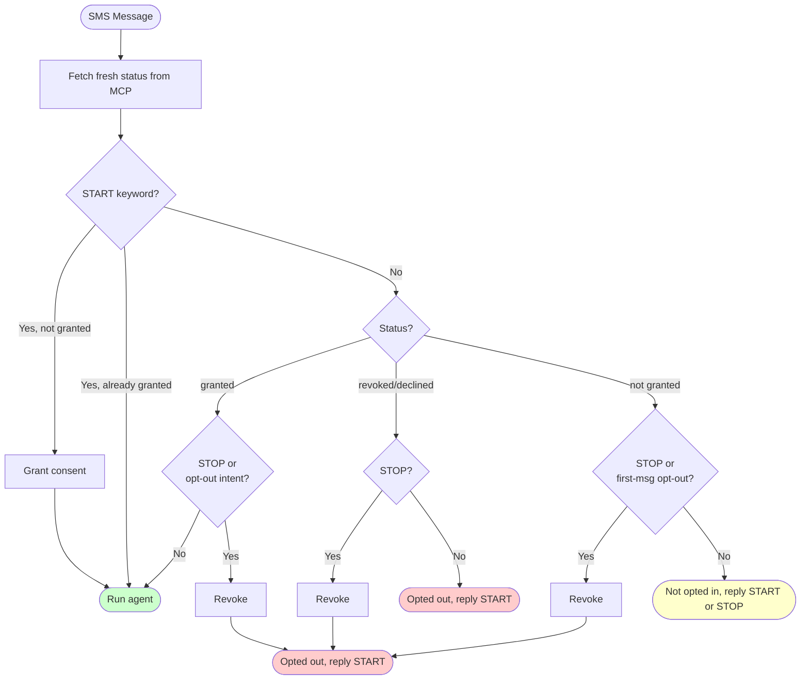

# SMS Consent

This document describes how SMS consent is handled for resident conversations.

## Scope

### SMS Channel (Pre-Agent Gate)
- Applies only to the SMS channel
- Applies only when `product_info.source` is not `AIRR`
- Requires `knock_mcp_server` to be available
- Handled by a pre-agent gate before the conversation reaches the agent

### VOICE Channel (In-Agent Workflow)
- Applies when the agent needs to send links via SMS during a voice call
- Handled by the Thinker agent via the "Sending Links" workflow in `INSTRUCTIONS.md`
- See [VOICE Channel SMS Consent](#voice-channel-sms-consent) section below

## Behavior Summary

| Status | First Message | Subsequent Messages |
|--------|---------------|---------------------|
| **granted** | Proceed (opt-out intent revokes and notifies) | Proceed (opt-out intent revokes and notifies) |
| **revoked** or **declined** | Notify opted out (only START re-enables) | Notify opted out (only START re-enables) |
| **not granted** | Check keywords/intent, then return consent request | Return consent request (only START enables) |

> **Note**: The `declined` status is returned by APIv2 `main` and is treated identically to `revoked`.

The gate **blocks the agent** for all non-granted statuses. Messages are returned directly by the gate without invoking the agent.

## Flow Diagram

## Session State

Consent state is tracked in `SessionScope` with the following fields:

### SMS Channel Fields

| Field | Purpose |
|-------|---------|
| `sms_consent_status` | Current status: `granted`, `revoked`, `declined`, `new`, etc. |
| `sms_consent_recorded` | Whether this is the first message in the session (used by `is_first_message`) |

- **Every message**: Fetches fresh status from MCP (no caching - status may change externally)
- **First message** (`sms_consent_recorded == False`): Additionally checks for opt-out intent via LLM when status is not granted
- **Subsequent messages**: Skips LLM opt-out classification for non-granted statuses (exact `STOP` keyword still works)

The gate returns messages directly — the agent's instructions (`INSTRUCTIONS.md`) contain no SMS consent logic. The agent only runs when status is `"granted"`.

### VOICE Channel Fields

| Field | Purpose |
|-------|---------|
| `voice_sms_consent_confirmed` | True after user confirms SMS consent this session (VOICE only) |

See [VOICE Channel SMS Consent](#voice-channel-sms-consent) for details.

## Gate Response Messages

The gate returns messages directly to the user without invoking the agent. Messages are localized (English/Spanish) based on simple language detection of the user's input.

### Opt-Out Message

Returned when a user opts out (STOP keyword or LLM-detected opt-out intent):

| Language | Message |
|----------|---------|
| English | "You are opted out of SMS. To opt back in, reply START." |
| Spanish | "No estás inscrito en SMS. Para volver a inscribirte, responde START." |

### Consent Request Message

Returned when status is not granted and the user didn't say START or opt out.

For `revoked` or `declined` status:

| Language | Message |
|----------|---------|
| English | "You are opted out of SMS. To opt back in, reply START." |
| Spanish | "No estás inscrito en SMS. Para volver a inscribirte, responde START." |

For `new` or unknown status:

| Language | Message |
|----------|---------|
| English | "You are not opted in to SMS. To opt in, reply START or to opt out, reply STOP." |
| Spanish | "No estás inscrito en SMS. Para inscribirte, responde START o para rechazar, responde STOP." |

### Error Fallback

If the gate encounters an exception, it sets status to `REVOKED` and returns the opt-out message.

## Opt-In / Opt-Out Rules

| Action | Trigger | When |
|--------|---------|------|
| **Opt-in** | Exact `START` keyword only | Any non-granted status |
| **Opt-out** | Exact `STOP` keyword | Any message, any status |
| **Opt-out** | LLM intent detection | Granted status: every message. Not granted: first message only. |

Key design decisions:
- **Opt-in is strict**: Only the exact `START` keyword can grant consent (no LLM classification)
- **Opt-out when granted**: LLM classification checks for opt-out intent on every message
- **Opt-out when not granted**: LLM classification only runs on the first message; subsequent messages are blocked without LLM call (user can still use exact `STOP` keyword)
  - If LLM classification fails, returns `False` (no opt-out) - user can still use exact `STOP` keyword
  - No regex fallback patterns (removed for simplicity and to avoid false positives)
- **Revoked/Declined users**: Only `START` keyword can re-enable (all other messages get opt-out notification)

## MCP Tools

| Tool | Purpose |
|------|---------|
| `check_resident_sms_opt_in_status` | Read current consent status |
| `update_resident_sms_consent_information` | Update consent status |

When updating consent, the gate includes `source: "renter-ai"` to identify the request origin. This ensures APIv2 returns the correct status:
- APIv2 `main`: Returns `declined` (source is accepted but doesn't affect behavior)
- APIv2 `alpha`: Returns `revoked` when source is `renter-ai`

## Error Handling

If the consent gate fails (MCP unavailable, exceptions):
- Sets `context.sms_consent_status = ConsentStatus.REVOKED`
- Returns `GateResult(action="return_message")` with the opt-out message — the agent does not run
- User can send `START` to opt in on the next message
- Logs the error for debugging

If LLM opt-out classification fails:
- Returns `False` (treats as no opt-out intent detected)
- User can still use exact `STOP` keyword to opt out
- Logs warning for debugging

## VOICE Channel SMS Consent

The VOICE channel has a separate SMS consent workflow for sending links during voice calls. This is handled entirely within the agent (not by a pre-agent gate).

### When It Applies

- During a VOICE call when the resident requests a link (e.g., payment portal, package tracking, service request status)
- The Thinker agent handles the workflow via the "Sending Links" section in `INSTRUCTIONS.md`

### Workflow

Applies to **link-producing workflows only** (SR creation, parking passes, packages, events, rent/balance, lease). General conversation or property info questions do not trigger an SMS consent check.

1. **Check opt-in status in parallel with primary action**: When a workflow action produces a link, call `check_resident_sms_opt_in_status` in parallel with that action (zero added latency).
2. **Ask the right question up front**: Based on the consent status returned:
   - If "granted": "I can send you the link by text — would you like me to send you that link?"
   - If "new": Ask opt-in question ("Would you like to receive text messages from our community? I can text you the link."), then update consent
   - If "declined"/"revoked": Offer to re-opt-in ("Would you like to receive text messages from our community? I can text you the link."), then update consent
3. **If user says yes and status was not granted**: Call `update_resident_sms_consent_information` + `create_link` in parallel.
4. **Send link**: Call `send_sms_on_behalf_of_manager` with the link from `create_link`

### Optimization: `sms_consent_confirmed` Flag

To avoid redundant `update_resident_sms_consent_information` calls when sending multiple links in a single voice session:

- **Flag**: `context.sms_consent_confirmed` (default: `False`)
- **Set by**: MCP post-processor after `update_resident_sms_consent_information` succeeds
- **Effect**: When `True`, the prompt conditionally omits the instruction to call `update_resident_sms_consent_information`

This means:
- **First link request**: Full workflow including consent update
- **Subsequent link requests**: Skip consent update (already recorded)

### Key Differences from SMS Channel

| Aspect | SMS Channel | VOICE Channel |
|--------|-------------|---------------|
| **Trigger** | Every SMS message | Only when sending links |
| **Handler** | Pre-agent gate | In-agent workflow (Thinker) |
| **Consent prompt** | Text-based (START/STOP keywords) | Voice-based (natural language) |
| **Session tracking** | `sms_consent_status`, `sms_consent_recorded` | `sms_consent_confirmed` |
| **Optimization** | Fresh MCP fetch every message | Skip consent update after first confirmation |
