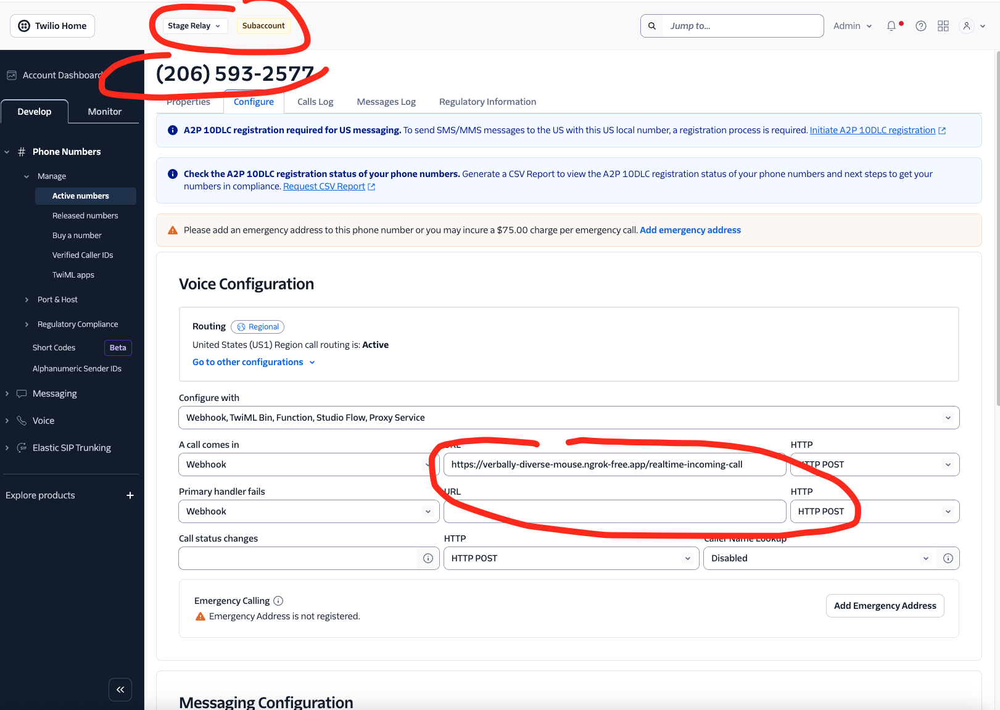

# Voice

> **Note**: This document describes the original `twilio_handler.py` implementation.
> A modular refactor (`src/agent_leasing/voice/`) is gated behind the
> `USE_VOICE_REFACTOR` feature flag — see [VOICE_ARCHITECTURE.md](VOICE_ARCHITECTURE.md).

## Using the Voice UI

The Voice UI only supports real-time agents.

Visit `/voice-ui`

If local, visit http://localhost:8000/voice-ui

## Local setup for Twilio voice calls

1. Start the server
    - Run `uv run server` in the root directory of the project
    - Ensure that the required MCP server(s) is running to support the agent(s) you are working with
    - See the main [README](../README.md) and [DEVELOPMENT.md](DEVELOPMENT.md) for details.

2. Start ngrok. If you don't have ngrok download it from https://ngrok.com/downloads
    - This is used to expose your local server to the internet for Twilio to access
    - Open another tab in your terminal and Run `ngrok http http://localhost:8000`
    - You will see a forwarding URL like `https://9eca-136-158-62-42.ngrok-free.app -> http://localhost:8000`
    - Copy the forwarding URL

3. Login to `console.twilio.com` with your RealPage email address
    - If you don't see the knock account, ask your manager to add you
    - Go to the Twilio Console and navigate to `Stage Relay` subaccount
    - Navigate to `Phone Numbers` > `Manage` > `Active Numbers` and search for a number you want to use.
    - Update the input for `a call comes in` to the ngrok URL you copied and add the endpoint
    - It should look like this: `<ngrok-forwarding>/<endpoint>` 
      or `https://9eca-136-158-62-42.ngrok-free.app/incoming-call` for SST/TTS and `https://9eca-136-158-62-42.ngrok-free.app/realtime-incoming-call` for real-time.

4. Call the number or, if using Unified Communications (UC), log in to https://uc-virtual-phone.realpage.com/dashboard and
    - Create a new phone number if there is none
    - Call the number
    - The call should reach twilio and from twilio to your local server.
    - Have a conversation and watch the server logs

### Using TWILIO_TEST_PAYLOAD

When Twilio does not supply a payload (for example, when testing directly from Twilio), the server falls back to a local test payload.

- Default: `examples.ASK_REQUEST_RESIDENT_VOICE_KNCK`
- Override: set `TWILIO_TEST_PAYLOAD` to a JSON file containing the full payload

Example:

```shell
TWILIO_TEST_PAYLOAD=./fixtures/twilio_payload.json uv run server
```

A screenshot of Twilio configured to call the `/realtime-incoming-call` endpoint.



# Realtime Twilio Integration 

## How It Works

1. **Incoming Call**: When someone calls your Twilio number, Twilio makes a request to `/realtime-incoming-call`
2. **TwiML Response**: The server returns TwiML that:
    - Plays a greeting message
    - Connects the call to a WebSocket stream at `/media-stream`
3. **WebSocket Connection**: Twilio establishes a WebSocket connection for bidirectional audio streaming
4. **Transport Layer**: The `TwilioRealtimeTransportLayer` class owns the WebSocket message handling:
    - Takes ownership of the Twilio WebSocket after initial handshake
    - Runs its own message loop to process all Twilio messages
    - Handles protocol differences between Twilio and OpenAI
    - Twilio media streams use G.711 μ-law at 8kHz; set `OPENAI_AUDIO_FORMAT=g711_ulaw` for Twilio calls
    - Manages audio chunk tracking for interruption support
    - Wraps the OpenAI realtime model instead of subclassing it
5. **Audio Processing**:
    - Audio from the caller is base64 decoded, optionally noise-reduced (`TWILIO_INPUT_AUDIO_NOISE_REDUCTION_ENABLED=true`), and sent to OpenAI Realtime API
    - Audio responses from OpenAI are base64 encoded and sent back to Twilio
    - Twilio plays the audio to the caller

## Troubleshooting

-   **WebSocket connection issues**: Ensure your ngrok URL is correct and publicly accessible
-   **Audio quality**: Twilio streams audio in μ-law at 8kHz; enable `TWILIO_INPUT_AUDIO_NOISE_REDUCTION_ENABLED=true` to reduce background noise
-   **Latency**: Network latency between Twilio, your server, and OpenAI affects response time
-   **Logs**: Check the console output for detailed connection and error logs

## Feature Flags

-   `PREAMBLE_SPEECH_DETECTION_ENABLED` (default: `false`): When `true`, require the voice agent to begin speaking a preamble before the thinker tool runs. Set to `false` if speech start detection is unreliable and blocks tool calls.
-   `FILLER_ESCALATION_ENABLED` (default: `true`): When `true`, switch from passive fillers to an escalation message after `FILLER_ESCALATION_THRESHOLD` consecutive fillers with no thinker running. Prevents infinite filler loops when the model fails to call the thinker. See [FILLER_PHRASES.md](FILLER_PHRASES.md) for details.
-   `GREETING_AGENT_ENABLED` (default: `false`): When `true`, start voice calls with a lightweight greeting agent while the full resident voice agent initializes in parallel. For `resident_one_voice`, the greeting agent still uses the shared `VOICE_RESPONDER.md` welcome workflow, so `WELCOME_MESSAGE_SECTIONS` and `custom_greeting` behavior remain consistent.
-   `WELCOME_MESSAGE_SECTIONS` (default: `[]`): Optional welcome sections for resident greetings. `"services"` enables the capabilities line (for example, "I can help with ..."). `"insights"` enables insight-news mentions and the first-turn prefetch that populates them.

## LangSmith Tracing

Voice calls produce a LangSmith trace that spans the entire call lifecycle. The trace lives in TwilioHandler and is the parent for all child runs logged during the call.

### Root run creation

The root `ls.RunTree` is created inside `_twilio_message_loop()` using a `with ls.trace(...)` context manager. This happens before the first Twilio message is processed, so every event in the call is captured under a single trace.

```python
with ls.trace(
    project_name=f"{settings.environment}_{Product.RESIDENT_VOICE.value}",
    name=Product.RESIDENT_ONE_VOICE.value,
    run_type="chain",
) as run:
    self.root_run = run
```

The project name is environment-scoped (e.g. `prod_renter_ai_resident_voice`). The root run is stored as `self.root_run` and referenced throughout the handler.

### Metadata

Metadata is attached to the root run in two stages during `_agent_setup()`:

1. **OpenAI trace identifiers** (added early, before agent initialization): `openai_trace_id` and `openai_group_id`. These are set first so they appear in LangSmith even if the call crashes during agent setup.

2. **Full call metadata** (added after agent initialization):
    - `environment`, `property-id`, `resident-id`, `company-id`
    - `product`, `property-name`, `start-time` (ISO timestamp)
    - `call-sid`, `chat-session-id`, `request-id`
    - `openai-group-url`, `openai-trace-id`
    - `input` (original prompt), `caller`, `thread-id`

Metadata keys are normalized (hyphens replaced with underscores) via `normalize_metadata_keys()` before being added to the run.

### Dual tracing: LangSmith + OpenAI

Each voice call produces traces in both LangSmith and OpenAI's tracing platform. The `trace_id` and `group_id` (generated via `gen_trace_id()` and `gen_group_id()` from the Agents SDK) are shared across both systems. The same metadata dict is also pushed to OpenAI's `RealtimeModelTracingConfig` so server-side OpenAI traces carry the same context.

The `SessionScope` context receives `self.root_run.to_headers()` as `langsmith_run_tree`, which allows downstream tools (thinker, MCP calls) to attach their own traces as children of the root run.

### Child runs

Child runs are created under the root run for every conversation message and for call lifecycle events. All message types -- agent, agent filler, and human -- flow through the same tracing path.

**`trace_messages_to_langsmith()`** is called on every `agent_end` event. It iterates over conversation history and creates an `llm`-type child run for each message not yet logged:

- **HumanMessage**: A child run for each user message (`role == "user"`).
- **AIMessage**: A child run for each assistant message (`role == "assistant"`). This includes both regular agent responses and filler messages -- fillers are triggered differently (via `_send_input_audio_timeout_message()` through the inactivity loop) but once OpenAI produces a response, it enters conversation history as a normal assistant message and gets traced identically.

Messages are deduplicated via `self.viewed_messages` (a set of `item_id` values), so each message produces exactly one child run regardless of how many `agent_end` events fire.

**`call_hangup`**: When the call ends via a Twilio `stop` event (user hung up, not agent-initiated), a child run named `call_hangup` is created with an output message indicating the user ended the call.

**`language_classification`**: During realtime data-curation logging, per-message language detection is grouped under a single `chain` child run named `language_classification`. The individual classifier calls for each transcript execute inside that parent span so the trace shows one classification block instead of a flat list of unrelated child runs.

### Trace lifecycle

1. **Start**: The `ls.trace()` context manager opens when `_twilio_message_loop()` begins (immediately after WebSocket accept).
2. **Active**: The root run accumulates metadata and child runs throughout the call.
3. **End**: The context manager exits when `_twilio_message_loop()` returns -- either from a WebSocket disconnect, a JSON parse error, or `self.call_active` being set to `False`. The `finally` block in `_twilio_message_loop()` calls `_cleanup_call()` before the context manager closes.
4. **Context cleanup**: `_clear_context()` explicitly preserves `langsmith_run_tree` in the `SessionScope` because it is needed for the final `RunTree.patch()` call when the context manager exits.

### Timestamp tracking

TwilioHandler tracks timestamps for filler scheduling and call state management. The key fields are `_last_audio_time`, `_next_filler_time`, and the state transitions in `CallStateManager`. Here is how each message type flows through the system:

**Agent messages (regular responses)**

1. User finishes speaking: `history_updated` event fires with `status == "completed"`. This calls `mark_user_speaking_stopped()` and `mark_agent_processing_started()` on `CallStateManager`, then `_schedule_next_filler()` which resets `_last_audio_time = now` and computes `_next_filler_time = now + gauss(mean, std)`.
2. First audio chunk arrives: `_handle_realtime_audio_event()` calls `mark_agent_speaking_started(is_filler=False)`, which clears `is_agent_processing` and sets `is_agent_speaking = True`. Each audio chunk also calls `_schedule_next_filler()`, continuously pushing the filler deadline forward.
3. Audio ends: `audio_end` event calls `_schedule_next_filler()` one more time.
4. Last mark arrives: `_on_response_completed()` calls `mark_agent_speaking_stopped()` when no more pending marks remain.
5. LangSmith: An `AIMessage` child run is created by `trace_messages_to_langsmith()` on the next `agent_end` event.

**Agent filler messages**

1. Trigger: `_input_audio_inactivity_loop()` polls every 1s. When `time.time() >= _next_filler_time` and `can_send_filler()` returns `True` (no one is speaking or processing), it calls `_send_input_audio_timeout_message()`.
2. Before sending, `_next_speech_is_filler = True` is set so the first audio chunk knows this is a filler.
3. First audio chunk arrives: `_handle_realtime_audio_event()` reads `_next_speech_is_filler`, resets it, and calls `mark_agent_speaking_started(is_filler=True)`. This sets `is_filler_playing = True` on `CallStateManager`.
4. From this point forward, the filler follows the exact same audio/mark/completion path as a regular agent message. `_schedule_next_filler()` is called on each audio chunk and on `audio_end`, pushing the next filler deadline forward.
5. LangSmith: The filler response appears in conversation history as a normal assistant message. `trace_messages_to_langsmith()` creates an `AIMessage` child run for it -- identical to a regular agent message.

**Human messages**

1. Audio arrives: Twilio `media` events are buffered and flushed to OpenAI via `_flush_audio_buffer()`. No timestamp tracking happens here.
2. Interruption (user speaks over agent): `audio_interrupted` event fires, calling `mark_user_speaking_started()`. This sets `is_user_speaking = True`, which blocks filler sending via `can_send_filler()`. The inactivity loop also reschedules the filler timer whenever `is_user_speaking` is true.
3. User finishes: `history_updated` with `status == "completed"` calls `mark_user_speaking_stopped()` and `_schedule_next_filler()`, restarting the filler countdown.
4. LangSmith: A `HumanMessage` child run is created by `trace_messages_to_langsmith()` on the next `agent_end` event.

**`_schedule_next_filler()` reset triggers**

This method is called from many places to keep the filler deadline current. The full list: `_trigger_initial_greeting()`, `_setup_realtime_session()`, each audio chunk in `_handle_realtime_audio_event()`, `audio_end` events, `history_updated` with completed user message, `_handle_guardrail_tripped_event()`, mark events in `_handle_mark_event()`, `_send_input_audio_timeout_message()` (after sending a filler), and `_recover_realtime_session()`. Any audio activity from either side resets the countdown.

### Connecting traces to sessions

The trace URL is stored in `self.ctx.langsmith_trace_url` and logged to stdout. It is also sent to Kafka for data curation (via `realtime_util.log_data_curation_event_for_realtime_history()`), making it available in downstream analytics and the session viewer.

## Architecture

### Direct calls
```
Phone Call → Twilio → WebSocket → TwilioRealtimeTransportLayer → OpenAI Realtime API
                                              ↓
                                      RealtimeAgent with Tools
                                              ↓
                           Audio Response → Twilio → Phone Call
```

The `TwilioRealtimeTransportLayer` acts as a bridge between Twilio's Media Streams and OpenAI's Realtime API, handling the protocol differences and audio format conversions. It wraps the OpenAI realtime model to provide a clean interface for Twilio integration.

### Calls through APIv2 tracking numbers

UNDER CONSTRUCTION
```
Phone Call → APiv2 -> Gen AI Service -> OpenAI Realtime API
                                              ↓
                                      RealtimeAgent with Tools
                                              ↓
                           Audio Response → Twilio → Phone Call
```

Return to the main [README](../README.md).
